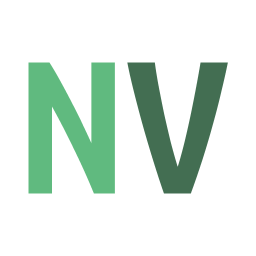
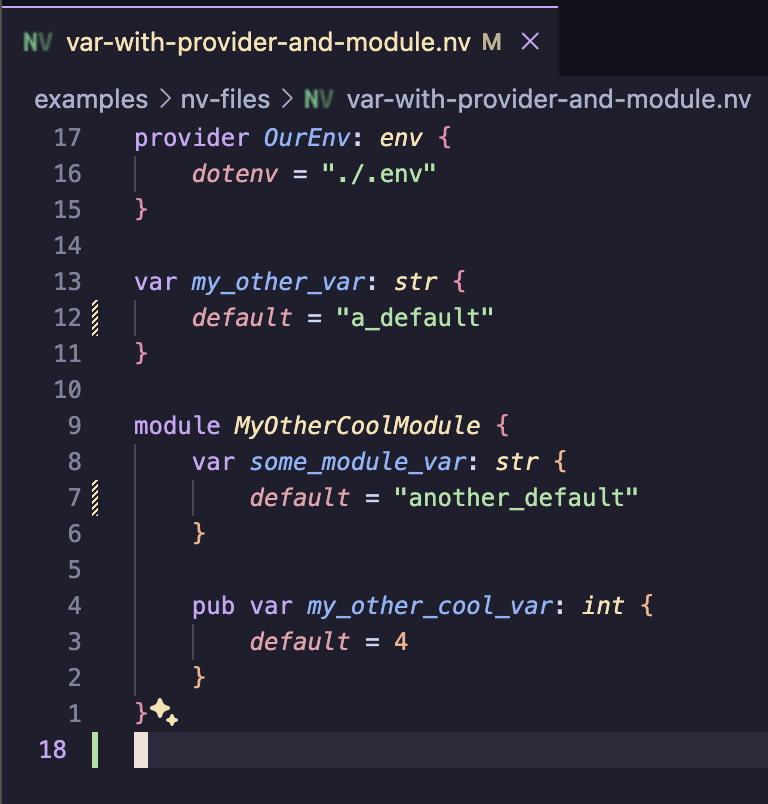

# nv

A language for configuration.

|                                                          |                                                                                                        |
| -------------------------------------------------------- | ------------------------------------------------------------------------------------------------------ |
|  |  |

[nv FigJam discovery board](https://www.figma.com/file/YLWiYaLvchfUlrbmr4P0M2/NV-Discovery?type=whiteboard&node-id=0%3A1&t=7aag2YKaHTLDS4lW-1)

## Packages

- Lexer - [Source](./packages/lexer/src/lib.rs)
- Parser - [README](./packages/parser/README.md) [Source](./packages/parser/src/lib.rs)
- Resolvers
  - Variable Resolver - [Source](./packages/resolvers/var/src/lib.rs)
  - Provider Resolver - [Source](./packages/resolvers/provider/lib.rs)
- Language Server - [Source](./packages/language-server/src/main.rs)
  - Position Indexer - [Source](./packages/position_indexer/src/lib.rs)
- Code Generation
  - JavaScript - [Source](./packages/code-generation/javascript/src/lib.rs)
- Code Formatter - **TODO**
- Providers
  - Env [Source](./packages/providers/providers/env/src/lib.rs)
  - AWS Secrets Manager [Source](./packages/providers/providers/aws-secrets-manager/src/lib.rs)
  - AWS KMS - **TODO**
  - GCP Secret Manager - **TODO**
  - Azure Key Vault - **TODO**
  - HasiCorp Vault - **TODO**
  - [some_other_provider] - **TODO**
  - [some_distributed_provider] - **TODO**
- Provider Registry - **TBD**
- Config Registry - **TBD**
- Cloud Service - **TBD**

### Client libraries

- Rust - **WIP**
- TypeScript/JavaScript - **WIP**
- Python - **TODO**
- Go - **WIP**
- C - **TODO**
- C++ - **TODO**
- SWIFT - **TODO**
- CSS - **TBD**

## Extensions

- VSCode - [README](./extensions/vscode-nv/README.md) [Grammar](./extensions/vscode-nv/syntaxes/nv.tmLanguage.json) [Language Server Client Source](./extensions/vscode-nv/language-server-client/extension.ts)
- treesitter - [README](./extensions/tree-sitter-nv/README.md) [Grammar](./extensions/tree-sitter-nv/grammar.js)
- github-linguist - **TODO**

## Examples

A lot of packages have an examples/ directory to show simple usage of the packages API.

## LSP

https://github.com/lbennett-stacki/nv/assets/5678671/e2fd9685-4905-41f7-8cf5-e948d3d7ccb8](https://github.com/lbennett-stacki/nv/assets/5678671/e2fd9685-4905-41f7-8cf5-e948d3d7ccb8
