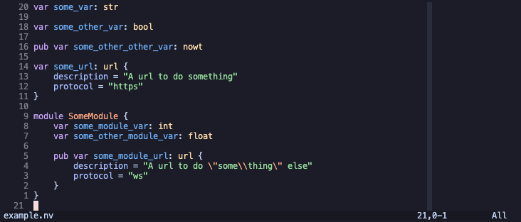

# tree-sitter-nv

neovim tree-sitter grammar, parser and queries for `nv` language support.



## Development

### Build and install from source

If you are installing tree-sitter-nv locally there are a few steps.

#### Configure `nvim-treesitter`

1. Install tree-sitter-cli

   ```sh
   npm i -g tree-sitter-cli
   # or
   cargo install tree-sitter-cli
   ```

2. Create a local parsers dir

   ```sh
   tree-sitter init-config
   mkdir ~/.tree-sitter-parsers
   nvim [config-path] # [config-path] is printed by init-config

   # Add the path of your new .tree-sitter-parsers dir to the parser-directories array and save
   ```

3. Configure `nvim-treesitter` lua

   In `~/.config/nvim/lua/config/treesitter.lua` or wherever you configure treesitter...

   ```lua
   local parser_config = require "nvim-treesitter.parsers".get_parser_configs()

   parser_config.nv = {
       install_info = {
           url = "~/.tree-sitter-parsers/tree-sitter-nv",
           files = {"src/parser.c"},
       },
       filetype = "nv",
   }
   ```

4. Configure `nvim` lua

   In `~/.config/nvim/lua/config/pre_deps.lua` or wherever you configure neovim...

   ```lua
       vim.filetype.add("nv")
       vim.cmd [[
           au BufRead,BufNewFile *.nv set filetype=nv
       ]]
   ```

5. Build

   In this repo, run `npm run build`.

   You can also run `npm run test` to build and test.

6. Link parser

   ```sh
       ln -s [tree_sitter_nv_source_absolute_path] [user_dir_absolute_path]/.tree-sitter-parsers/tree-sitter-nv
   ```

7. Link queries

   ```sh
       ln -s [tree_sitter_nv_source_absolute_path]/queries [tree_sitter_install_dir_absolute_path]/queries/nv
   ```
